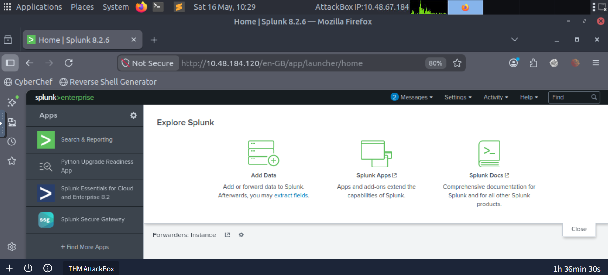
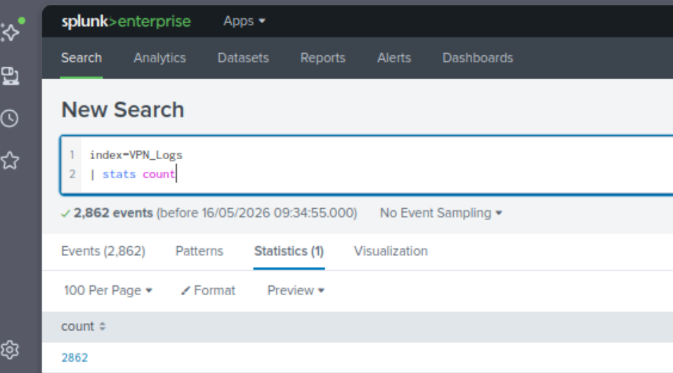
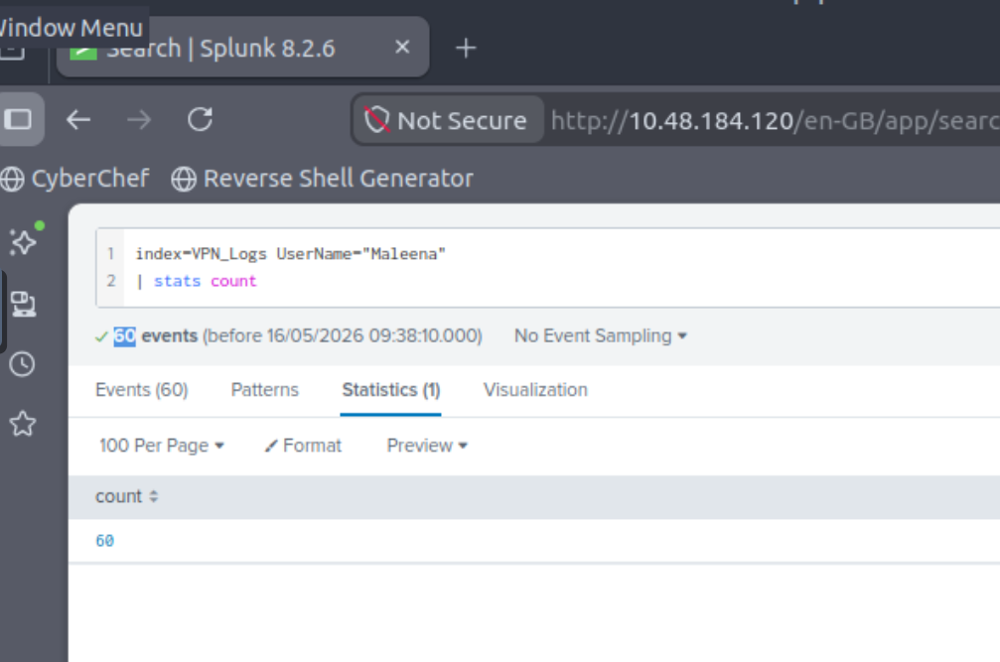
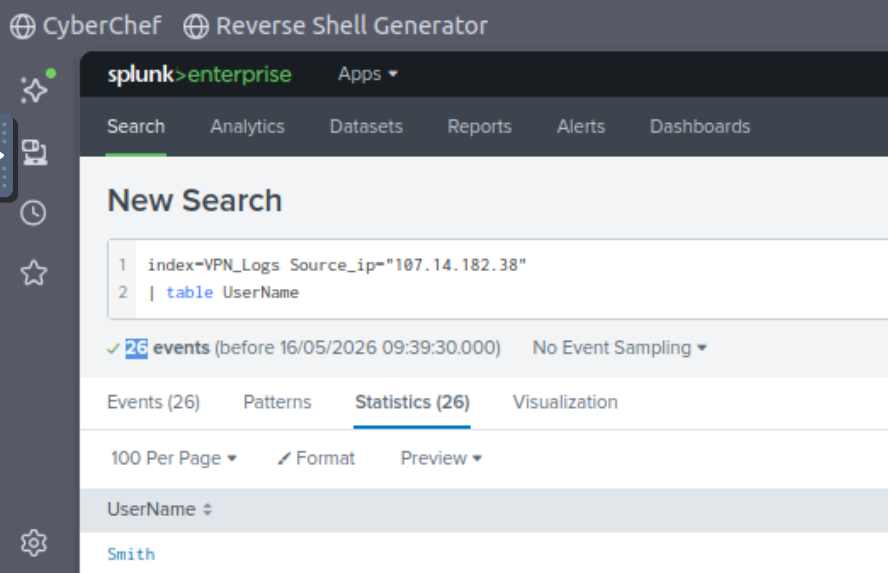
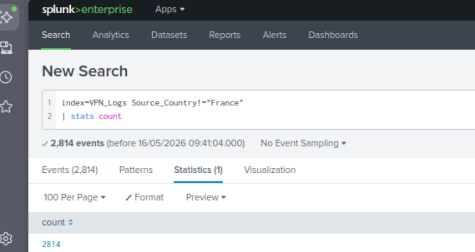
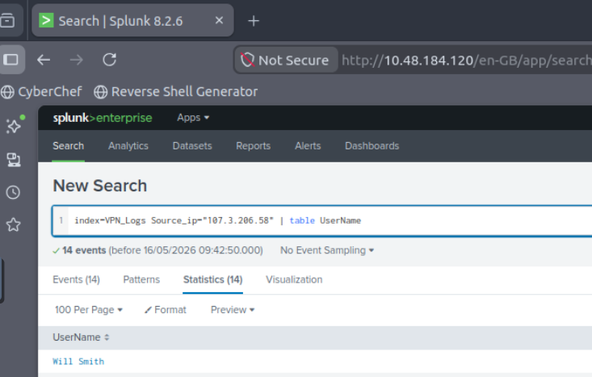
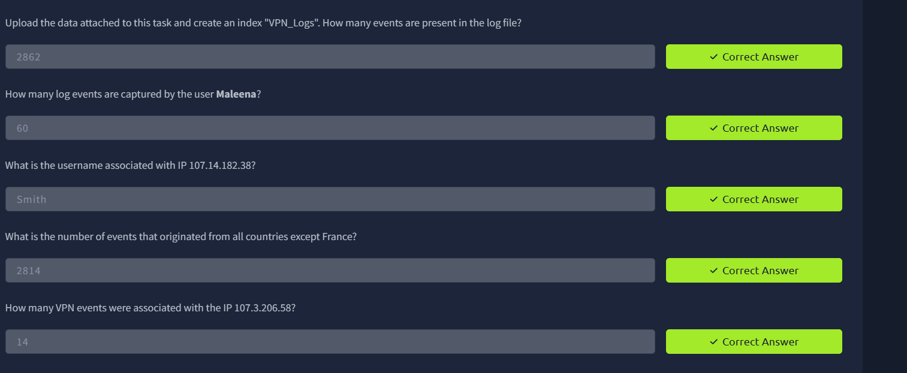

# Splunk VPN Log Analysis

## Overview

This project demonstrates hands-on experience with Splunk Enterprise for Security Operations Center (SOC) style log analysis. The objective was to ingest VPN log data, perform SPL (Search Processing Language) queries, investigate events, and extract actionable insights from the dataset.

This mini project showcases:

* Log ingestion and indexing in Splunk
* SPL query writing
* Event filtering and aggregation
* Basic threat hunting workflow
* SOC analyst investigation process
* Dashboard/search workflow understanding

---

# Project Information

## Environment

| Component           | Details                               |
| ------------------- | ------------------------------------- |
| Platform            | Splunk Enterprise 8.2.6               |
| Dataset             | VPNLogs.json                          |
| Operating System    | Kali Linux (THM AttackBox)            |
| Use Case            | VPN log investigation and analysis    |
| Skills Demonstrated | SPL, SIEM Investigation, Log Analysis |

---

# Skills Demonstrated

* Splunk Enterprise Administration Basics
* Data Upload & Index Creation
* SPL Query Writing
* Event Counting
* Field-based Filtering
* IP Investigation
* User Activity Tracking
* Threat Hunting Basics
* SOC Workflow Understanding

---

# Step 1 – Launch Splunk Enterprise

Opened Splunk Enterprise inside the lab environment and navigated to the Search & Reporting application.

## Screenshot



---

# Step 2 – Upload VPN Log Dataset

Uploaded the `VPNLogs.json` file into Splunk using the Add Data workflow.

### Actions Performed

1. Clicked **Add Data**
2. Selected the VPNLogs.json file
3. Configured source settings
4. Prepared dataset for indexing

## Screenshot


---

# Step 3 – Create Custom Index

Created a dedicated Splunk index named:

```bash
VPN_Logs
```

Using a custom index helps organize security datasets and improves investigation workflow.

## Screenshot


---

# Step 4 – Verify Data Ingestion

After indexing the logs, verified that the data was successfully ingested.

## SPL Query

```spl
index=VPN_Logs
| stats count
```

## Result

```text
2862 events
```

## Investigation Insight

This confirms that the VPN dataset was successfully indexed and searchable.

## Screenshot



---

# Step 5 – Investigate Specific User Activity

Investigated the number of events generated by the user `Maleena`.

## SPL Query

```spl
index=VPN_Logs UserName="Maleena"
| stats count
```

## Result

```text
60 events
```

## Investigation Insight

This query filters events associated with a specific user account to measure activity volume.

## Screenshot



---

# Step 6 – Investigate Source IP Address

Performed IP-based investigation to identify the username associated with a suspicious source IP.

## SPL Query

```spl
index=VPN_Logs Source_ip="107.14.182.38"
| table UserName
```

## Result

```text
Smith
```

## Investigation Insight

This type of query is useful during incident response when analysts need to map IP addresses to user identities.

## Screenshot



---

# Step 7 – Country-Based Event Analysis

Analyzed VPN events originating from all countries except France.

## SPL Query

```spl
index=VPN_Logs Source_Country!="France"
| stats count
```

## Result

```text
2814 events
```

## Investigation Insight

Country filtering is commonly used in SOC environments to identify anomalous login activity or geo-based access patterns.

## Screenshot



---

# Step 8 – Analyze Events by Source IP

Investigated how many VPN events originated from a specific IP address.

## SPL Query

```spl
index=VPN_Logs Source_ip="107.3.206.58"
| table UserName
```

## Result

```text
User: Will Smith
Events: 14
```

## Investigation Insight

This query helps correlate source IP activity with user sessions and event volume.

## Screenshot



---

# Step 9 – Final Validation

Validated all investigation results inside the lab environment.

## Verified Results

| Investigation Task         | Result |
| -------------------------- | ------ |
| Total Events               | 2862   |
| Maleena User Events        | 60     |
| Username for 107.14.182.38 | Smith  |
| Events Outside France      | 2814   |
| Events from 107.3.206.58   | 14     |

## Screenshot



---

# Key SPL Queries Used

## Count All Events

```spl
index=VPN_Logs
| stats count
```

## Filter by Username

```spl
index=VPN_Logs UserName="Maleena"
| stats count
```

## Find Username by IP

```spl
index=VPN_Logs Source_ip="107.14.182.38"
| table UserName
```

## Country-Based Filtering

```spl
index=VPN_Logs Source_Country!="France"
| stats count
```

## Investigate IP Activity

```spl
index=VPN_Logs Source_ip="107.3.206.58"
| stats count
```

---

# What I Learned

Through this project, I gained practical exposure to:

* Splunk search workflow
* SIEM investigation methodology
* Writing efficient SPL queries
* Event correlation techniques
* User and IP tracking
* Security log analysis
* Data ingestion process in Splunk

---

# Future Improvements

Planned enhancements for this project:

* Create Splunk dashboards
* Add geo-location visualization
* Build alert rules
* Detect brute-force login attempts
* Create scheduled reports
* Integrate threat intelligence feeds
* Build SOC monitoring use cases

---


# Author

Kumar Batchu

B.Tech CSE | Cybersecurity Enthusiast | SOC Analyst Aspirant
